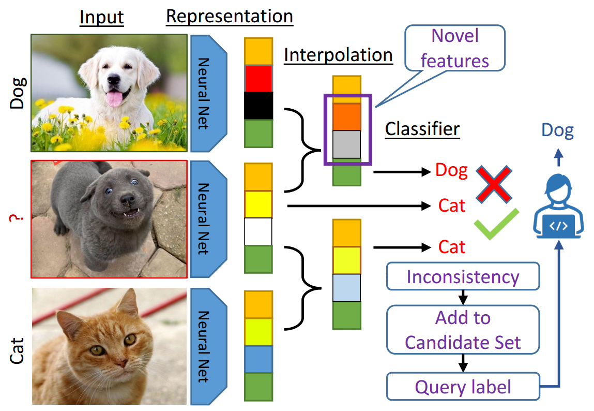

# Active Learning by Feature Mixing (ALFA-Mix)
PyTorch implementation of ALFA-Mix. For details, read the paper [Active Learning by Feature Mixing](https://arxiv.org/abs/2203.07034), which is accepted in CVPR 2022.

<div align="center">
  
</div>

The code includes the implementations of all the baselines presented in the paper. Parts of the code are borrowed from https://github.com/JordanAsh/badge.

## Setup
The dependencies are in [`requirements.txt`](requirements.txt). Python=3.8.3 is recommended for the installation of the environment.


## Datasets
The code supports torchvision built-in implementations of MNIST, EMNIST, SVHN, CIFAR10 and CIFAR100.
Additionally, it supports [MiniImageNet](https://www.kaggle.com/datasets/whitemoon/miniimagenet?select=mini-imagenet-cache-val.pkl), [DomainNet-Real](http://ai.bu.edu/M3SDA/) (and two subsets of that) and [OpenML](https://www.openml.org/) datasets.

## Training
For running ALFA-Mix in a single setting, use the following script that by default uses 5 different initial random seeds: 
```python
python main.py \
        --data_name MNIST --data_dir your_data_directory --log_dir your_log_directory \
        --n_init_lb 100 --n_query 100 --n_round 10 --learning_rate 0.001 --n_epoch 1000 --model mlp \
        --strategy AlphaMixSampling --alpha_opt
```
To run the closed-form variation of ALFA-Mix, set `--alpha_closed_form_approx --alpha_cap 0.2`.
It includes the implementations of all the baselines reported in the paper, including:
* Random
* [Entropy](https://ieeexplore.ieee.org/document/6889457)
* [BALD](https://arxiv.org/abs/1703.02910)
* [CoreSet](https://openreview.net/forum?id=H1aIuk-RW)
* [Adversarial Deep Fool](https://arxiv.org/abs/1802.09841)
* [GCNAL](https://arxiv.org/abs/2006.10219)
* [CDAL](https://arxiv.org/abs/2008.05723)
* [BADGE](https://arxiv.org/abs/1906.03671)

## Evaluation
To evaluate over all the experiments and get the final comparison matrix, all the results should be gathered in a folder with this structure: Overall/Dataset/Setting (e.g. Overall/MNIST/MLP_small_budget).
The script below accumulates all results over various settings in each dataset and generates the overall comparison matrix:
```python
python agg_results.py --directory Path/Overall --dir_type general 
```
By using `dataset` or `setting` for `--dir_type`, you can evaluate the results at dataset or setting level respectively.

## Citing
```
@inproceedings{parvaneh2022active,
  title={Active Learning by Feature Mixing},
  author={Parvaneh, Amin and Abbasnejad, Ehsan and Teney, Damien and Haffari, Gholamreza Reza and van den Hengel, Anton and Shi, Javen Qinfeng},
  booktitle={Proceedings of the IEEE/CVF Conference on Computer Vision and Pattern Recognition},
  pages={12237--12246},
  year={2022}
}
```